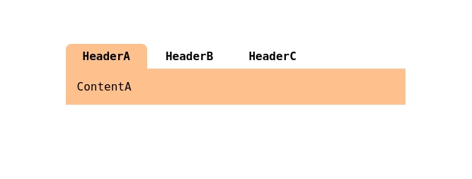

## Drawbacks

Supports only static switching between content tabs  
( Headers & content panes cannot be scrolled horizontally )


## Example

-   [Minimal](https://codepen.io/DoomCommerce/pen/NWQdgpG)
-   [Themed](https://codepen.io/DoomCommerce/pen/VwoPQpz)


## Structure

```html
<div class = Tabs >
    
    <div class = Tab >

        <input
            value = X
            name = Tabs
            type = radio
            id = TabX
        />

        <label 
            class = Header
            for = TabX 
        > HeaderX </label>

        <div class = Content >
            ContentX
        </div>

    </div>

    ...

</div>
```

## Vital Styling

```css
.Tabs {
    flex-wrap : wrap ;
    display : flex ;
}


.Tab {
    display : contents ;
}

.Tab input {
    display : none ;
}


.Header {
    order : -1 ;
}

input:checked ~ .Header {
    background : #00000022 ;
}


.Content {
    width : 100% ;
    order : 1 ;
}

input:not(:checked) ~ .Content {
    display : none ;
}
```
